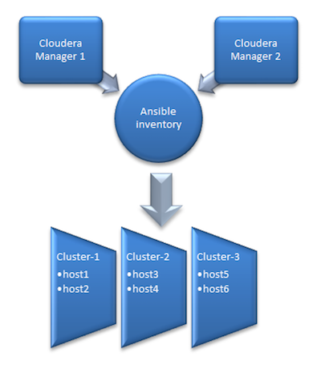

# Cloudera Playbook 

An Ansible Playbook that installs the Cloudera stack on RHEL/CentOS

# Running the playbook

* Setup an [Ansible Control Machine](http://docs.ansible.com/ansible/intro_installation.html) 
* Create Ansible configuration (optional):

```ini
$ vi ~/.ansible.cfg

[defaults]
# disable key check if host is not initially in 'known_hosts'
host_key_checking = False

[ssh_connection]
# if True, make ansible use scp if the connection type is ssh (default is sftp)
scp_if_ssh = True
```

* Create [Inventory](http://docs.ansible.com/ansible/intro_inventory.html) of cluster hosts:

```ini
$ vi ~/ansible_hosts

[scm_server]
host1.example.com        license_file=/path/to/cloudera_license.txt

[db_server]
host2.example.com

[krb5_server]
host3.example.com        default_realm=<REALM>

[utility_servers:children]
scm_server
db_server
krb5_server

[gateway_servers]
host4.example.com        host_template=HostTemplate-Gateway role_ref_names=HDFS-HTTPFS-1

[master_servers]
host5.example.com        host_template=HostTemplate-Master1
host6.example.com        host_template=HostTemplate-Master2
host7.example.com        host_template=HostTemplate-Master3

[worker_servers]
host8.example.com
host9.example.com
host10.example.com

[worker_servers:vars]
host_template=HostTemplate-Workers

[cdh_servers:children]
utility_servers
gateway_servers
master_servers
worker_servers
```

**Important**: fully qualified domain name (FQDN) is mandatory in the ansible_hosts file
   
* Run playbook
 
```shell
$ ansible-playbook -i ~/ansible_hosts cloudera-playbook/site.yml
    
-i INVENTORY
   inventory host path or comma separated host list (default=/etc/ansible/hosts)
```

Ansible communicates with the hosts defined in the inventory over SSH. It assumes you’re using SSH keys to authenticate so your public SSH key should exist in ``authorized_keys`` on those hosts. Your user will need sudo privileges to install the required packages.

By default Ansible will connect to the remote hosts using the current user (as SSH would). To override the remote user name you can specify the ``--user`` option in the command, or add the following variables to the inventory:

```ini
[all:vars]
ansible_user=ec2-user
```

AWS users can use Ansible’s ``--private-key`` option to authenticate using a PEM file instead of SSH keys.

# Enabling Kerberos

The playbook can install a local MIT KDC and configure Hadoop Security. To enable Hadoop Security:

* Specify the '[krb5_server]' host in the inventory (see above)
* Set 'krb5_kdc_type' to 'mit' in ``group_vars/krb5_server.yml``

# Overriding CDH service/role configuration

The playbook uses [Cloudera Manager Templates](https://www.cloudera.com/documentation/enterprise/latest/topics/install_cluster_template.html) to provision a cluster.
As part of the template import process Cloudera Manager applies [Autoconfiguration](https://www.cloudera.com/documentation/enterprise/latest/topics/cm_mc_autoconfig.html)
rules that set properties such as memory and CPU allocations for various roles.

If the cluster has different hardware or operational requirements then you can override these properties in ``group_vars/cdh_servers``. 
For example:

```
cdh_services:
  - type: hdfs        
    datanode_java_heapsize: 10737418240
```

These properties get added as variables to the rendered template's instantiator block and can be referenced from the service configs.
For example ``roles/cdh/templates/hdfs.j2``:

```json
"roleType": "DATANODE",
"configs": [{
  "name": "datanode_java_heapsize",
  "variable": "DATANODE_JAVA_HEAPSIZE"
}
```

# Dynamic inventory script for Cloudera Manager

Cloudera Manager specific dynamic inventory script has been created for easy integration. These are the main advantages:

* Cache management of inventory for better performance
* Cloudera Manager’s HTTP cookie handling   
* Multi Cloudera Manager support
* SSL friendly as the root CA check of Cloudera Manager server can be disabled or enabled

<p align="center">
<br/>
High level architecture of Ansible dynamic inventory vs. Cloudera Managers
</p>


## Configuration

**Step 1**: Configuration of the related Cloudera Manager(s)

```ini
$ export CM_URL=https://cm1.example.com:7183,https://cm2.example.com:7183
$ export CM_USERNAME=username
```

Other optional configuration parameters:

```ini
$ export CM_CACHE_TIME_SEC=3600
$ export CM_DISABLE_CA_CHECK=True
$ export CM_TIMEOUT_SEC=60
$ export CM_DEBUG=False
```

Note: it is recommended to add these environment variables to the startup file of your shell, for example: $HOME/.bashrc

**Step 2**: Installation of the git package:

```
# yum install git
```

**Step 3**: Installation of the Ansible package:

```
# yum install ansible
```

**Step 4**: Clone the cloudera-playbook git repository:

```
$ git clone https://github.com/cloudera/cloudera-playbook
```

Note: The cloudera-playbook git repository is not officially supported by Cloudera, but its use is recommended.

**Step 5**: Setup the default Ansible inventory and other useful Ansible [parameters](https://raw.githubusercontent.com/ansible/ansible/devel/examples/ansible.cfg):

```ini
$ vi $HOME/.ansible.cfg
[defaults]
inventory = $HOME/cloudera-playbook/dynamic_inventory_cm
# Do not gather the host information (facts) by default. This can give significant speedups for large clusters.
gathering = explicit
# Disable key check if host is not initially in 'known_hosts'
host_key_checking = False
[ssh_connection]
# If it is True, make ansible use scp if the connection type is ssh (default is sftp)
scp_if_ssh = True
```

Note: please update the inventory path of the dynamic_inventory_cm if it is necessary

**Step 6**: Change the working directory to cloudera-playbook

```
$ cd cloudera-playbook
```

**Step 7**: The available Cloudera Manager clusters (Ansible groups, for example: Cluster_1, Balaton) can be listed with the following command:

```
$ ./dynamic_inventory_cm --list
```

Note: the inventory cache can be refreshed in the following way if the CM_URL changed:

```
$ ./dynamic_inventory_cm --refresh-cache
```

**Step 8**: Setup the SSH public key authentication for remote hosts:

If  ~/.ssh/id_rsa.pub and ~/.ssh/id_rsa files do not exist, they need to be generated using the ssh-keygen command prior to attempting connection to the managed hosts:

```
$ ansible all -m authorized_key -a key="{{ lookup('file', '~/.ssh/id_rsa.pub') }} user=$USER" --ask-pass -u $USER --become-user $USER
```

root user can be used with the following example:

```
$ ansible all -m authorized_key -a key="{{ lookup('file', '~/.ssh/id_rsa.pub') }} user=root" --ask-pass -u root
```

**Step 9**: Test remote host connectivity (optional):

```
$ ansible all -m ping -u $USER --become-user $USER
```

root user can be used with the following example:

```
$ ansible all -m ping -u root
```

**Step 10**: Ad-hoc command feature enables running single and arbitrary Linux commands on all hosts. It can be used to troubleshoot slow group resolution issues. 

Example Ansible Ad-Hoc commands (Balaton is a group of hosts which is a cluster in Cloudera Manager):

```
$ ansible Balaton -u $USER --become-user $USER -m command -o -a "time id -Gn $USER" 
$ ansible all -u $USER --become-user $USER -m command -o -a "date"
```

root user can be used with the following example:

```
$ ansible Balaton -m command -o -a "time id -Gn testuser" -u root
$ ansible all -m command -o -a "date" -u root
```

For further information about dynamic inventory and Ad-Hoc commands can be found here:

* [Developing Dynamic Inventory](http://docs.ansible.com/ansible/latest/dev_guide/developing_inventory.html)
* [Documentation of Ansible Ad-Hoc commands](http://docs.ansible.com/ansible/latest/intro_adhoc.html)

## SSSD setup with Ansible (applicable for RHEL 7 / CentOS 7) 

**Step 1**: Edit the default variables in group_vars/all:

```
krb5_realm: AD.SEC.EXAMPLE.COM
ad_domain: "{{ krb5_realm.lower() }}"
cluster_domain: gce.example.com
kdc: w2k8-1.ad.sec.example.com
computer_ou: ou=computer_hosts,ou=hadoop_prd,dc=ad,dc=sec,dc=example,dc=com
```

**Step 2**: Enable kerberos on the hosts:

If necessary update this template file:

```
roles/krb-client/templates/krb5.conf.j2
```

and run this command to apply it on the managed hosts:

```
$ ansible-playbook -u root enable_kerberos.yaml
```

**Step 3**: Join the host(s) to realm:

If necessary update these template files:

```
roles/realm/join/templates/sssd.conf.j2
roles/realm/join/templates/realmd.conf.j2
roles/realm/join/templates/nscd.conf.j2
```

and run this command to apply it on the managed hosts:

```
$ ansible-playbook -u root realm_join.yaml
bind user: administrator
bind password:
```

Removing hosts from the realm can be done via:

```
$ ansible-playbook -u root realm_leave.yaml
```

# How do I contribute code?
You need to first sign and return an
[ICLA](https://github.com/cloudera/cloudera-playbook/blob/master/icla/Cloudera_ICLA_25APR2018.pdf)
and
[CCLA](https://github.com/cloudera/cloudera-playbook/blob/master/icla/Cloudera_CCLA_25APR2018.pdf)
before we can accept and redistribute your contribution. Once these are submitted you are
free to start contributing to cloudera-playbook. Submit these to CLA@cloudera.com.

# Main steps
* Fork the repo and create a topic branch
* Push commits to your repo
* Create a pull request!

## Find
We use Github issues to track bugs for this project. Find an issue that you would like to
work on (or file one if you have discovered a new issue!). If no-one is working on it,
assign it to yourself only if you intend to work on it shortly.

## Fix

Please write a good, clear commit message, with a short, descriptive title and
a message that is exactly long enough to explain what the problem was, and how it was
fixed.

License
-----------
[Apache License, Version 2.0](http://www.apache.org/licenses/LICENSE-2.0)
