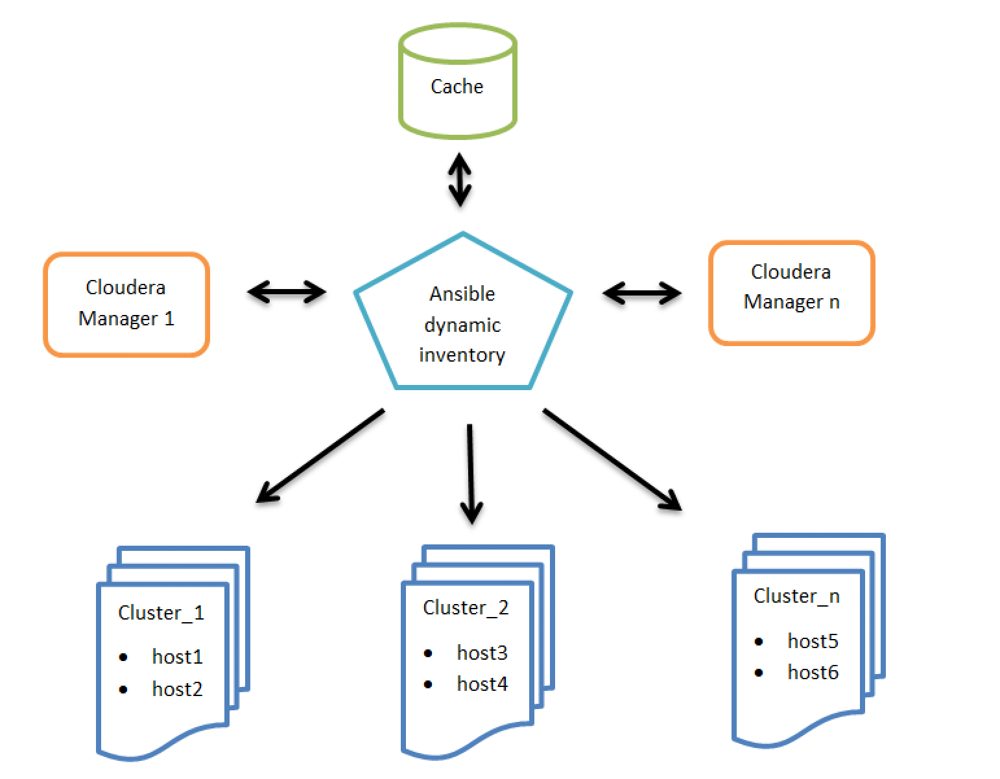

# Cloudera Playbook 

An Ansible Playbook that installs the Cloudera stack on RHEL/CentOS

## Running the playbook

* Setup an [Ansible Control Machine](http://docs.ansible.com/ansible/intro_installation.html). 

**Please do not use Ansible 2.9.0**. This version has an [issue with templating](https://github.com/ansible/ansible/issues/64745) which causes the playbook execution to fail. Instead, use any 2.8.x version or a later 2.9.x version as these are not affected. 

* Create Ansible configuration (optional):

```ini
$ vi ~/.ansible.cfg

[defaults]
# disable key check if host is not initially in 'known_hosts'
host_key_checking = False

[ssh_connection]
# if True, make ansible use scp if the connection type is ssh (default is sftp)
scp_if_ssh = True
```

* Create [Inventory](http://docs.ansible.com/ansible/intro_inventory.html) of cluster hosts:

```ini
$ vi ~/ansible_hosts

[scm_server]
host1.example.com

[db_server]
host2.example.com

[krb5_server]
host3.example.com

[utility_servers:children]
scm_server
db_server
krb5_server

[edge_servers]
host4.example.com        host_template=HostTemplate-Edge role_ref_names=HDFS-HTTPFS-1

[master_servers]
host5.example.com        host_template=HostTemplate-Master1
host6.example.com        host_template=HostTemplate-Master2
host7.example.com        host_template=HostTemplate-Master3

[worker_servers]
host8.example.com
host9.example.com
host10.example.com

[worker_servers:vars]
host_template=HostTemplate-Workers

[cdh_servers:children]
utility_servers
edge_servers
master_servers
worker_servers
```

**Important**: fully qualified domain name (FQDN) is mandatory in the ansible_hosts file
   
* Run playbook
 
```shell
$ ansible-playbook -i ~/ansible_hosts cloudera-playbook/site.yml
    
-i INVENTORY
   inventory host path or comma separated host list (default=/etc/ansible/hosts)
```

Ansible communicates with the hosts defined in the inventory over SSH. It assumes you’re using SSH keys to authenticate so your public SSH key should exist in ``authorized_keys`` on those hosts. Your user will need sudo privileges to install the required packages.

By default Ansible will connect to the remote hosts using the current user (as SSH would). To override the remote user name you can specify the ``--user`` option in the command, or add the following variables to the inventory:

```ini
[all:vars]
ansible_user=ec2-user
```

AWS users can use Ansible’s ``--private-key`` option to authenticate using a PEM file instead of SSH keys.

## Enabling Kerberos

The playbook can install a local MIT KDC and configure Hadoop Security. To enable Hadoop Security:

* Specify the '[krb5_server]' host in the inventory (see above)
* Set 'krb5_kdc_type' to 'MIT KDC' in ``group_vars/krb5_server.yml``

## Overriding CDH service/role configuration

The playbook uses [Cloudera Manager Templates](https://www.cloudera.com/documentation/enterprise/latest/topics/install_cluster_template.html) to provision a cluster.
As part of the template import process Cloudera Manager applies [Autoconfiguration](https://www.cloudera.com/documentation/enterprise/latest/topics/cm_mc_autoconfig.html)
rules that set properties such as memory and CPU allocations for various roles.

If the cluster has different hardware or operational requirements then you can override these properties in ``group_vars/cdh_servers``. 
For example:

```
cdh_services:
  - type: hdfs        
    datanode_java_heapsize: 10737418240
```

These properties get added as variables to the rendered template's instantiator block and can be referenced from the service configs.
For example ``roles/cdh/templates/hdfs.j2``:

```json
"roleType": "DATANODE",
"configs": [{
  "name": "datanode_java_heapsize",
  "variable": "DATANODE_JAVA_HEAPSIZE"
}
```

## Dynamic Inventory Script for Cloudera Manager
 
To make integration easier, Gabor Roczei created a dynamic inventory [script](https://github.com/cloudera/cloudera-playbook/blob/master/dynamic_inventory_cm_py2) that allows Ansible to gather data from Cloudera Manager. Its main advantages are:

* Cache management of inventory for better performance
* Cloudera Manager’s HTTP cookie handling   
* Support for multiple Cloudera Manager instances
* SSL-friendly, as the root CA check of the Cloudera Manager server can be disabled or enabled

<p align="center">
<br/>
High level architecture of Ansible dynamic inventory vs. Cloudera Managers
</p>

### Configuration

**Step 1**: Configuration of the related Cloudera Manager(s)

```ini
$ export CM_URL=https://cm1.example.com:7183,https://cm2.example.com:7183
$ export CM_USERNAME=username
```

Other optional configuration parameters:

```ini
$ export CM_CACHE_TIME_SEC=3600
$ export CM_DISABLE_CA_CHECK=True
$ export CM_TIMEOUT_SEC=60
$ export CM_DEBUG=False
```

Note: We recommend adding these environment variables to the startup file of your shell. For example: $HOME/.bashrc

**Step 2**: Installation of the git package:

```
# yum install git
```

**Step 3**: Installation of the Ansible package:

```
# yum install ansible
```

**Step 4**: Clone the cloudera-playbook git repository:

```
$ git clone https://github.com/cloudera/cloudera-playbook
```

Note: The cloudera-playbook git repository is not officially supported by Cloudera, but the authors recommend using it.

**Step 5**: Setup the default Ansible inventory and other useful Ansible [parameters](https://raw.githubusercontent.com/ansible/ansible/devel/examples/ansible.cfg):

```ini
$ vi $HOME/.ansible.cfg
[defaults]
# Python 2 version:
inventory = $HOME/cloudera-playbook/dynamic_inventory_cm_py2
# Python 3 version:
# inventory = $HOME/cloudera-playbook/dynamic_inventory_cm_py3
# Do not gather the host information (facts) by default. This can give significant speedups for large clusters.
# gathering = explicit
# Disable key check if host is not initially in 'known_hosts'
host_key_checking = False
[ssh_connection]
# If it is True, make ansible use scp if the connection type is ssh (default is sftp)
scp_if_ssh = True
```

Note: Update the inventory path of the dynamic_inventory_cm_py2 if necessary

**Step 6**: Change the working directory to cloudera-playbook

```
$ cd cloudera-playbook
```

**Step 7**: The available Cloudera Manager clusters (Ansible groups, such as Cluster_1, Balaton) can be listed with the following command:

```
$ ./dynamic_inventory_cm_py2 --list
```

Note: The cache of the Cloudera Manager inventory can be refreshed with the following command:

```
$ ./dynamic_inventory_cm_py2 --refresh-cache
```

**Step 8**: Setup the SSH public key authentication for remote hosts:

The big advantage of this is that with ad-hoc commands, you do not need to enter your password each time you run the command, but only the first time you enter the private key password.

If the ~/.ssh/id_rsa.pub and ~/.ssh/id_rsa files do not exist, they need to be generated with the ssh-keygen command prior to connecting to the managed hosts.

Launch a subshell with the following command: 

```
$ ssh-agent bash
```

You will execute the rest of the commands in this How-To article in the subshell. 

Add the SSH private key into the SSH authentication agent: 

```
$ ssh-add ~/.ssh/id_rsa
```

Validate:

```
$ ssh-add -L
```

Upload the SSH public key (id_rsa.pub) to the managed hosts:

```
$ ansible all -m authorized_key -a key="{{ lookup('file', '~/.ssh/id_rsa.pub') }} user=$USER" --ask-pass -u $USER --become-user $USER
```

For example, you can use the root user:

```
$ ansible all -m authorized_key -a key="{{ lookup('file', '~/.ssh/id_rsa.pub') }} user=root" --ask-pass -u root
```

Note: If you do not want to use SSH public key authentication, add the --ask-pass parameter each time you run the Ansible command.

 
**Step 9**: Test remote host connectivity (optional):

```
$ ansible all -m ping -u $USER --become-user $USER
```

For example, you can execute the command with the root user:

```
$ ansible all -m ping -u root
```

**Step 10**: The ad-hoc command feature enables running single and arbitrary Linux commands on all hosts. You can use this to troubleshoot slow group resolution issues. 

The following commands are example ad-hoc commands where Balaton is a group of hosts that is a cluster in Cloudera Manager: 

```
$ ansible Balaton -u $USER --become-user $USER -m command -o -a "time id -Gn $USER" 
$ ansible all -u $USER --become-user $USER -m command -o -a "date"
```

The following example uses the root user:

```
$ ansible Balaton -m command -o -a "time id -Gn testuser" -u root
$ ansible all -m command -o -a "date" -u root
```

Further information about dynamic inventory and ad-hoc commands can be found in the Ansible documentation:

* [Developing Dynamic Inventory](http://docs.ansible.com/ansible/latest/dev_guide/developing_inventory.html)
* [Documentation of Ansible Ad-Hoc commands](http://docs.ansible.com/ansible/latest/intro_adhoc.html)

### SSSD setup with Ansible (applicable for RHEL 7 / CentOS 7) 

Cloudera blog articles:

* [Best Practices Guide for Systems Security Services Daemon Configuration and Installation – Part 1](https://blog.cloudera.com/best-practices-guide-for-systems-security-services-daemon-configuration-and-installation-part-1)
* [How-to: Automate the Systems Security Services Daemon Installation and Troubleshoot it with Ansible – Part 2](https://blog.cloudera.com/how-to-automate-the-systems-security-services-daemon-installation-and-troubleshoot-it-with-ansible-part-2)

**Step 1**: Edit the default variables in group_vars/all:

```
krb5_realm: AD.SEC.EXAMPLE.COM
krb5_kdc_type: Active Directory
krb5_kdc_host: w2k8-1.ad.sec.example.com
ad_domain: "{{ krb5_realm.lower() }}"
computer_ou: ou=computer_hosts,ou=hadoop_prd,dc=ad,dc=sec,dc=example,dc=com
ldap_group_search_base: OU=groups,OU=hadoop_prd,DC=ad,DC=sec,DC=example,DC=com
ldap_user_search_base: DC=ad,DC=sec,DC=example,DC=com?subtree?(memberOf=CN=hadoop_users,OU=groups,OU=hadoop_prd,DC=ad,DC=sec,DC=example,DC=com)
override_gid: 999999
ad_site: Default-First-Site-Name
```

**Step 2**: Enable kerberos on the hosts:

If necessary, update this template file (See the Ansible [Templating (Jinja2)](https://docs.ansible.com/ansible/latest/user_guide/playbooks_templating.html) documentation for more information):

```
templates/krb5.conf.j2
```

Run this command to apply it on the managed hosts:

```
$ ansible-playbook --tags krb5_client -u root site.yml
```

**Step 3**: Join the host(s) to realm:

If necessary, update these template files (See the Ansible [Templating (Jinja2)](https://docs.ansible.com/ansible/latest/user_guide/playbooks_templating.html) documentation for more information):

```
roles/realm/join/templates/sssd.conf.j2
roles/realm/join/templates/realmd.conf.j2
roles/realm/join/templates/nscd.conf.j2
```

Run this command to apply it on all managed hosts:

```
$ ansible-playbook -u root realm_join.yaml
bind user: administrator
bind password:
```

Run this command to apply it on a cluster (for example: Balaton) (See the Ansible [Best Practices](https://docs.ansible.com/ansible/latest/user_guide/playbooks_best_practices.html) documentation for more information):

```
$ ansible-playbook --limit Balaton -u root realm_join.yaml
bind user: administrator
bind password:
```

Remove all hosts from the realm with this command: 

```
$ ansible-playbook -u root realm_leave.yaml
```

Remove the Balaton hosts from the realm with this command (See the Ansible [Best Practices](https://docs.ansible.com/ansible/latest/user_guide/playbooks_best_practices.html) documentation for more information): 

```
$ ansible-playbook --limit Balaton -u root realm_leave.yaml
```

## How do I contribute code?
You need to first sign and return an
[ICLA](https://github.com/cloudera/cloudera-playbook/blob/master/icla/Cloudera_ICLA_25APR2018.pdf)
and
[CCLA](https://github.com/cloudera/cloudera-playbook/blob/master/icla/Cloudera_CCLA_25APR2018.pdf)
before we can accept and redistribute your contribution. Once these are submitted you are
free to start contributing to cloudera-playbook. Submit these to CLA@cloudera.com.

### Main steps
* Fork the repo and create a topic branch
* Push commits to your repo
* Create a pull request!

### Find
We use Github issues to track bugs for this project. Find an issue that you would like to
work on (or file one if you have discovered a new issue!). If no-one is working on it,
assign it to yourself only if you intend to work on it shortly.

### Fix

Please write a good, clear commit message, with a short, descriptive title and
a message that is exactly long enough to explain what the problem was, and how it was
fixed.

License
-----------
[Apache License, Version 2.0](http://www.apache.org/licenses/LICENSE-2.0)
